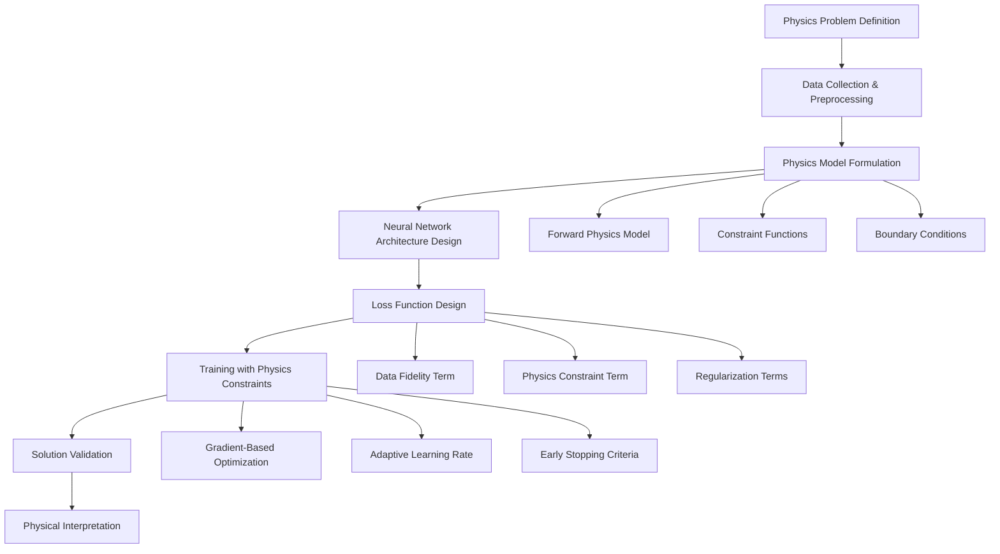

# Physics-Guided Neural Network (PGNN) Framework for Physics Problems

A comprehensive, extensible framework for solving physics problems using Physics-Guided Neural Networks (PGNNs). This implementation provides a unified approach for both forward and inverse physics problems by integrating domain-specific physical constraints directly into neural network training.

## 🎯 Conceptual Framework

The PGNN framework represents a paradigm shift from purely data-driven approaches to physics-informed machine learning. At its core, the methodology combines:

- **Neural Network Learning**: For capturing complex, nonlinear relationships in data
- **Physics Constraints**: For enforcing fundamental physical laws and domain knowledge
- **Deterministic Optimization**: For reproducible and reliable solutions

This integration creates a powerful synergy where neural networks learn from data while respecting physical principles, resulting in models that are both data-efficient and physically consistent.

## 🔬 General Methodology

The PGNN framework follows a systematic workflow that can be applied to diverse physics domains:



### Key Components

1. **Physics Problem Abstraction**: A unified interface for defining physics problems through the `PhysicsProblem` base class
2. **Adaptive Architecture**: Neural network designs that can be customized for different problem types
3. **Constraint Integration**: Flexible mechanisms for incorporating various types of physical constraints
4. **Optimization Strategy**: Deterministic training procedures with convergence guarantees

## 🚀 Key Innovations

### 1. Physics-Constrained Learning
- **Domain-Specific Constraints**: Enforces physical relationships through custom loss terms
- **Differentiable Physics**: Implements physics models as differentiable functions for gradient-based optimization
- **Multi-Scale Constraints**: Supports constraints at different spatial and temporal scales

### 2. Adaptive Architecture
- **Problem-Specific Design**: Neural network architectures that adapt to problem requirements
- **Flexible Input/Output**: Handles various input types (measurements, parameters) and outputs (predictions, designs)
- **Modular Components**: Swappable components for different physics domains

### 3. Unified Framework
- **Generic Base Class**: The `PhysicsProblem` abstract class provides a common interface
- **Problem Type Agnostic**: Supports both forward (continuous) and inverse (discrete) problems
- **Extensible Design**: Easy to add new physics domains without modifying core framework

### 4. Deterministic Optimization
- **Reproducible Results**: Fixed random seeds ensure consistent outcomes
- **Adaptive Learning**: Cosine-annealed learning rate balances exploration and exploitation
- **Stability-Based Stopping**: Terminates when solutions converge to stable values

## 🌐 Applicability to Physics Problems

The framework is designed to handle diverse physics problems through a unified approach:

### Problem Types

| Problem Type | Description | Example Applications |
|--------------|-------------|----------------------|
| **Forward Problems** | Predict system behavior from known parameters | Material characterization, response prediction |
| **Inverse Problems** | Determine parameters from observed behavior | Parameter estimation, design optimization |
| **Continuous Problems** | Variables in continuous domains | Material properties, field distributions |
| **Discrete Problems** | Variables in discrete domains | Design selection, parameter optimization |

## 📋 Implementation Examples

### Example 1: Indentation Problem (Forward Design)
**Domain**: Contact Mechanics & Material Characterization

This example demonstrates forward design - estimating material elastic moduli (E₁, E₂, E₃) from force-displacement data using Hertzian contact mechanics.

**Physics Model**:
- Hertzian contact theory for spherical indentation
- Material anisotropy constraints (E₂ ≥ E₃)
- Nonlinear hyperelastic material behavior

**Results**: Accurate estimation of orthotropic elastic moduli from experimental nanoindentation data.

### Example 2: Vessel Design Problem (Inverse Design)
**Domain**: Composite Structures & Optimization

This example demonstrates inverse design - finding optimal composite vessel design parameters to minimize weight while satisfying pressure constraints.

**Physics Model**:
- Composite laminate theory
- Pressure vessel design equations
- Manufacturing constraints (discrete ply angles, thicknesses)

**Results**: Optimal design parameters selected from discrete design space using direct dataset lookup.

## 🏗️ Framework Architecture

```
┌─────────────────────────────────────────────────────────────┐
│                    PGNN Framework                            │
├─────────────────────────────────────────────────────────────┤
│  Core Components                                           │
│  ├── Neural Network Architecture                           │
│  ├── Physics Constraint Engine                             │
│  ├── Optimization Module                                   │
│  └── Validation & Visualization                            │
├─────────────────────────────────────────────────────────────┤
│  Physics Problem Interface                                 │
│  ├── PhysicsProblem (Abstract Base Class)                 │
│  ├── Forward Model Implementation                          │
│  ├── Constraint Functions                                 │
│  └── Data Processing                                       │
├─────────────────────────────────────────────────────────────┤
│  Problem Implementations                                   │
│  ├── IndentationProblem (Contact Mechanics)               │
│  ├── VesselProblem (Composite Design)                      │
│  └── YourProblem (Extensible)                             │
└─────────────────────────────────────────────────────────────┘
```

## 🛠️ Extensibility Guidelines

The framework is designed for easy extension to new physics domains:

### Step 1: Define Your Physics Problem

Create a new class inheriting from `PhysicsProblem`:

```python
from physics.base import PhysicsProblem
import torch
import pandas as pd

class YourProblem(PhysicsProblem):
    def __init__(self):
        # Initialize problem-specific parameters
        self.phys_param1 = 10.0
        self.phys_param2 = 0.5
    
    def get_input_output_dims(self):
        """Return (input_dim, output_dim) for your problem."""
        return 3, 2  # Example: 3 inputs, 2 outputs
    
    def load_data(self, path):
        """Load and preprocess data. Return (input_tensor, observation_tensor)."""
        df = pd.read_csv(path)
        # Process your data here
        inp = torch.tensor(df[['col1', 'col2', 'col3']].values, dtype=torch.float32)
        obs = torch.tensor(df['target'].values, dtype=torch.float32).unsqueeze(1)
        return inp, obs
    
    def forward_physics(self, inp, predictions):
        """
        Implement your physics model.
        inp: model inputs (e.g., [x1, x2, x3])
        predictions: predicted parameters from neural network (e.g., [p1, p2])
        Returns: physics-based prediction
        """
        x1, x2, x3 = inp[:, 0], inp[:, 1], inp[:, 2]
        p1, p2 = predictions[:, 0], predictions[:, 1]
        
        # Your differentiable physics equations
        output = p1 * x1 + p2 * (x2**2) + x3
        return output.unsqueeze(1)
    
    def constraint_loss(self, predictions):
        """
        Optional: Enforce physical constraints.
        Return scalar loss (0 if no constraints).
        """
        p1, p2 = predictions[:, 0], predictions[:, 1]
        # Example: ensure p2 >= 0.1
        return torch.mean(torch.relu(0.1 - p2)**2)
    
    def is_discrete(self):
        """Return True for discrete inverse problems, False for continuous."""
        return False
```

### Step 2: Configure Training Parameters

Define bounds and training parameters specific to your problem:

```python
# Define parameter bounds for your problem
bounds = [(lower1, upper1), (lower2, upper2)]  # Example bounds

# Training configuration
config = {
    'patience': 250,           # Early stopping patience
    'tighten_epochs': 1500,    # Total training epochs
    'stable_epochs': 6,        # Epochs to verify stability
    'learning_rate': 1e-3,     # Initial learning rate
}
```

### Step 3: Train Your Model

```python
from physics.your_problem import YourProblem

if __name__ == '__main__':
    problem = YourProblem()
    
    model, history, inp, obs, predictions, physics_output = train(
        problem=problem,
        bounds=bounds,
        data_path='data/your_data.csv',
        **config
    )
```

## 📦 Installation

### Prerequisites

- Python 3.10+
- PyTorch 2.0+
- NumPy, SciPy
- Pandas, Matplotlib

### Local Setup

```bash
git clone <repository-url>
cd Physics-guided-Neural-Network-Inverse-Design-Pipeline
pip install torch pandas numpy scipy matplotlib
```

### Docker Setup

```bash
docker compose up --build
```

## 🚀 Quick Start

### Running the Indentation Problem (Default)

```bash
python main.py
```

This will:
1. Load experimental data from `data/data.csv`
2. Train the physics-guided neural network
3. Export results to `results/` directory
4. Generate visualization plots

### Running the Vessel Problem

Edit `main.py` and uncomment:
```python
# problem = IndentationProblem()  # ← Comment this out
problem = VesselProblem()  # ← Uncomment this
```

Then run:
```bash
python main.py
```

## 📊 Model Architecture

### Neural Network Design

- **Input Layer**: Problem-specific measurements (e.g., force + indentation)
- **Hidden Layers**: 3 layers × 72 neurons with BatchNorm and Tanh activation
- **Output Layer**: Problem-specific parameters (e.g., material properties, design variables)
- **Output Activation**: Bounds-constrained via `CustomActivation` (tanh scaling)

### Loss Function

The total loss combines data fidelity with physics constraints:

```
Total Loss = α × MSE(observation, physics_output) + β × constraint_loss + γ × regularization
```

Where:
- `α`, `β`, `γ` are weighting coefficients
- `constraint_loss` enforces physical laws and domain knowledge
- `regularization` prevents overfitting and ensures stability

## 📈 Theoretical Advantages

### Over Purely Data-Driven Approaches

1. **Data Efficiency**: Physics constraints reduce the amount of training data needed
2. **Generalization**: Physics-informed models generalize better to unseen conditions
3. **Interpretability**: Results are physically meaningful and interpretable
4. **Robustness**: Less sensitive to noise and outliers in training data
5. **Extrapolation**: Can make predictions outside the training data range

### Over Traditional Physics-Based Methods

1. **Complex Systems**: Can handle systems where analytical solutions are intractable
2. **Inverse Problems**: Naturally suited for inverse design and parameter estimation
3. **Multi-Physics**: Can integrate multiple physics domains in a unified framework
4. **Adaptability**: Can be updated with new data without complete reformulation

## 📁 Project Structure

```
├── main.py                     # Generic training orchestrator
├── physics/
│   ├── base.py                 # Abstract PhysicsProblem base class
│   ├── indentation.py          # IndentationProblem implementation
│   ├── vessel.py               # VesselProblem implementation
│   └── [your_problem].py       # Add custom physics problems here
├── visualization/
│   └── plotting.py             # Plotting and CSV export utilities
├── data/
│   ├── data.csv                # Indentation experimental data
│   └── pressure_vessel_DS.csv  # Vessel design dataset
├── results/                    # Output directory with predictions
├── Dockerfile, docker-compose.yml
└── README.md                   # This file
```

## 🔧 Configuration

### Training Parameters

Edit `main.py` to adjust:

- **Material bounds**: `bounds = [(30, 250), (300, 1200), (30, 300)]` for E1, E2, E3
- **Training parameters**: 
  - `patience=250` (early stopping patience)
  - `tighten_epochs=1500` (total training epochs)
  - `stable_epochs=6` (epochs to verify stability)

### Data Format

#### For Indentation Problem
`data/data.csv` should contain:
```
ind,force
0.0,0.0
0.01,0.5
...
```
Where `ind` is indentation (mm) and `force` is load (mN).

#### For Vessel Problem
`data/pressure_vessel_DS.csv` contains the design dataset with columns for:
- Design parameters (SAngle, Stepply, Nrplies, SymLam, Thickpl)
- Objective values (weight, safety factor, etc.)

## 📊 Output and Results

### Training Outputs

After training, results are saved to problem-specific directories:

- **predictions.csv**: Model predictions and physics-based outputs
- **loss_curves.png**: Training and constraint loss history
- **problem_specific.png**: Domain-specific visualizations

### Performance Metrics

The framework tracks:
- **Training Loss**: Combined loss over epochs
- **Constraint Violation**: Physics constraint satisfaction
- **Parameter Stability**: Convergence of predicted parameters
- **Prediction Accuracy**: Comparison with ground truth (when available)
